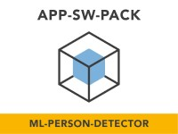
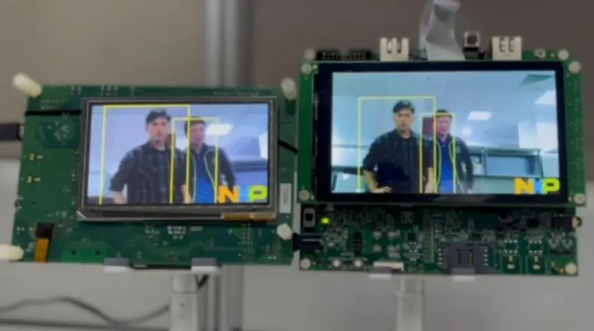
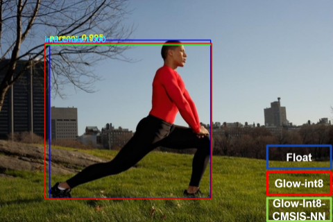
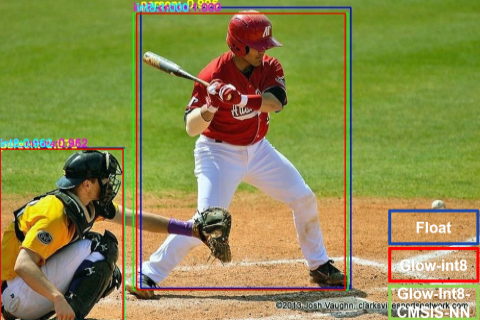

# NXP Application Center
[](https://www.nxp.com)

## ML Person Detector
<span style="color: rgb(23, 43, 77); font-family: -apple-system, BlinkMacSystemFont, &quot;Segoe UI&quot;, Roboto, Oxygen, Ubuntu, &quot;Fira Sans&quot;, &quot;Droid Sans&quot;, &quot;Helvetica Neue&quot;, sans-serif; font-size: 14px;">Step-by-step guide for development and deployment of a person detector using convolution neural network (CNN) on MCU-based systems.</span>

#### Boards: MIMXRT1170-EVK, EVK-MIMXRT1060
#### Peripherals: DISPLAY, VIDEO
#### Toolchains: MCUXpresso IDE

<p align="center">
	
</p>

## Table of Contents
1. [Overview](#step1)
2. [Resources](#step2)
3. [Assemble the Application](#step3)
4. [Build and Run the Application](#step4)
5. [ML-Person-Detector Verification on PC](#step5)
6. [Model Deployment](#step6)
7. [Other Reference Applications](#step7) 
8. [Reference](#step8)
9. [Release Notes](#step9)
10. [Support](#step10)

## 1. Overview<a name="step1"></a>
The person detection demo project are built on the NXP MCUs i.MX RT1170EVK and i.MX RT1060EVK respectively.
It is well known that the ML model inference usually requires huge computation, while there is usually a single core in MCU. It means that the single core needs to handle not only the model inference task, but also the camera and display parts.
To get a real-time performance for capturing the image from camera and showing frame with algorithm results on the display screen, we built a Microcontroller based Vision Intelligence Algorithms (uVITA) System based on FreeRTOS. And the demo is given as below, running on the NXP MCUs i.MX RT1170EVK and i.MX RT1060EVK respectively.



The following is a list of all components that are available in the ml_person_detector folder.

| Components                       | Description                                                                   |
|:---------------------------------|:------------------------------------------------------------------------------|
| scripts                          | Test scripts in Python for the multiple person detection model running on PC. |
| models                           | The original CNN model in format of ONNX.                                     |
| data                             | Test images and quantization calibration images.                              |
| converter                        | eIQ® Inference with Glow NN.                                                  | 
| app                              | The ML-Person-Detector project of the i.MX RT1170EVK and RT1060EVK.           |

## 2. Resources<a name="step2"></a>
* Purchase supported boards.
    * [MIMXRT1170-EVK](https://www.nxp.com/design/development-boards/i-mx-evaluation-and-development-boards/i-mx-rt1170-evaluation-kit:MIMXRT1170-EVK)
    * [MIMXRT1060-EVK](https://www.nxp.com/design/development-boards/i-mx-evaluation-and-development-boards/i-mx-rt1060-evaluation-kit:MIMXRT1060-EVKB)
* Install [MCUXpresso IDE v11.6.0+](https://www.nxp.com/design/software/development-software/mcuxpresso-software-and-tools-/mcuxpresso-integrated-development-environment-ide:MCUXpresso-IDE).

## 3. Assemble the Application<a name="step3"></a>
You need to have both Git and [West](https://docs.zephyrproject.org/latest/develop/west/index.html) installed, then execute below commands to gather the whole SDK delivery of the ml-person-detector.
```
west init -m ssh://git@bitbucket.sw.nxp.com/appswpacks/ml-person-detector.git --mr master appswpacks-ml-person-detector
cd appswpacks_ml_person_detector
west update
```

## 4. Build and Run the Application<a name="step4"></a>
To build and run the application, please refer to the lab guide in the Doc folder or check the steps in [Run a project using MCUXpresso IDE](https://github.com/NXPmicro/mcux-sdk/blob/main/docs/run_a_project_using_mcux.md).

## 5. ML-Person-Detector Verification on PC<a name="step5"></a>
 Dependent package: 
* opencv-python
* onnxruntime
* numpy

To use the verification tool, go to the *scripts* folder and run below commands.

### Image test

```python image_test.py```

### Video Test

```python video_test.py```

## 6. Model Deployment<a name="step6"></a>
In this section, eIQ® Inference with Glow NN is applied to enable ahead-of-time compilation and convert the neural networks into object files.
To follow the given deployment steps, you need to download the Glow installer from [eIQ-Glow](https://www.nxp.com/design/software/development-software/eiq-ml-development-environment/eiq-inference-with-glow-nn:eIQ-Glow)
and install it into the *converter* folder.

### Model profiling

Glow uses profile guided quantization, running inference to extract statistics regarding possible numeric values of each 
tensor within the neural network.Images in png format with the same resolution as the input should be prepared in advance. Using command below to generate yml proflie:

```image-classifier.exe -input-image-dir=data/Calibration -image-mode=0to1 -image-layout=NCHW -image-channel-order=BGR -model=models/Onnx/dperson_shufflenetv2.onnx -model-input-name=input.1 -dump-profile=models/Glow/dperson_shufflenetv2.yml```

Then you will get a *dperson_shufflenetv2.yml* under converter folder.

### Generate Glow bundle

Bundle generation represents the model compilation to a binary object file (bundle). Bundle generation is performed using the model-compiler tool.

* Compile a float32 model to an int8 bundle:

```model-compiler.exe -model=models/Onnx/dperson_shufflenetv2.onnx -model-input=input.1,float,[1,3,192,320] -emit-bundle=models/Glow/int8_bundle -backend=CPU -target=arm -mcpu=cortex-m7 -float-abi=hard -load-profile=models/Glow/dperson_shufflenetv2.yml -quantization-schema=symmetric_with_power2_scale -quantization-precision-bias=Int8```

* Compile a float32 model to an int8 bundle with CMSIS-NN:

```model-compiler.exe -model=models/Onnx/dperson_shufflenetv2.onnx -model-input=input.1,float,[1,3,192,320] -emit-bundle=models/Glow/int8_cmsis_bundle -backend=CPU -target=arm -mcpu=cortex-m7 -float-abi=hard -load-profile=models/Glow/dperson_shufflenetv2.yml -quantization-schema=symmetric_with_power2_scale -quantization-precision-bias=Int8 -use-cmsis```

### Quantization Model Verification
Here are two examples of the accuracy verification for the quantized model. Although there are slight difference on the person coordinations between the outputs of original float model and quantized ones, the overall detection results are relatively reliable with good precision.




## 7. Other Reference Applications<a name="step7"></a>
For other rapid-development software bundles please visit the [Application Software Packs](https://www.nxp.com/appswpack) page.

For SDK examples please go to the [MCUXpresso SDK](https://github.com/NXPmicro/mcux-sdk/) and get the full delivery to be able to build and run examples that are based on other SDK components.

## 8. Reference<a name="step8"></a>
* [WIDER FACE: A Face Detection Benchmark](http://shuoyang1213.me/WIDERFACE)
* https://github.com/dog-qiuqiu/FastestDet
* https://www.nxp.com/design/software/development-software/eiq-ml-development-environment/eiq-inference-with-glow-nn:eIQ-Glow)

## 9. Release Notes<a name="step9"></a>
| Version | Description / Update                           | Date                        |
|:-------:|------------------------------------------------|----------------------------:|
| 1.0     | Initial release on Application Code Hub          | May 16<sup>th</sup> 2023 |

## 10. Support<a name="step10"></a>
Questions regarding the content/correctness of this example can be entered as Issues within this GitHub repository.

>**Warning**: For more general technical questions regarding NXP Microcontrollers and the difference in expected funcionality, enter your questions on the [NXP Community Forum](https://community.nxp.com/)
#### Project Metadata
<!----- Boards ----->
[](https://github.com/search?q=org%3ANXP-mcuxpresso+MIMXRT1170-EVK+in%3Areadme&type=Repositories) [](https://github.com/search?q=org%3ANXP-mcuxpresso+EVK-MIMXRT1060+in%3Areadme&type=Repositories)
<!----- Technologies ----->
<!----- Applications ----->
<!----- Peripherals ----->
[](https://github.com/search?q=org%3ANXP-mcuxpresso+display+in%3Areadme&type=Repositories) [](https://github.com/search?q=org%3ANXP-mcuxpresso+video+in%3Areadme&type=Repositories)
<!----- SocialMedia ----->
[](https://www.youtube.com/@NXP_Semiconductors)
[](https://www.linkedin.com/company/nxp-semiconductors)
[](https://www.facebook.com/nxpsemi/)
[](https://twitter.com/NXP)

